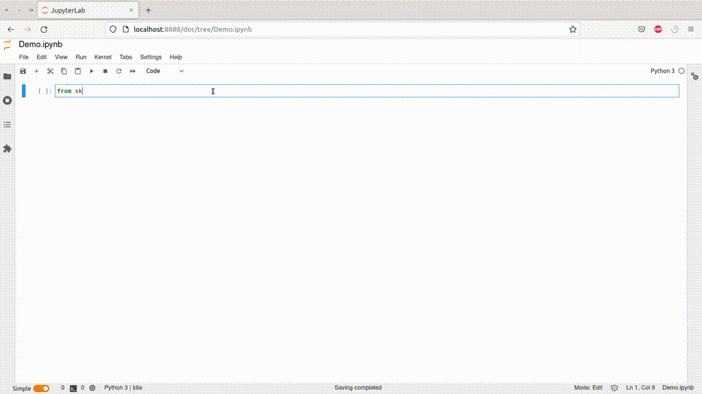
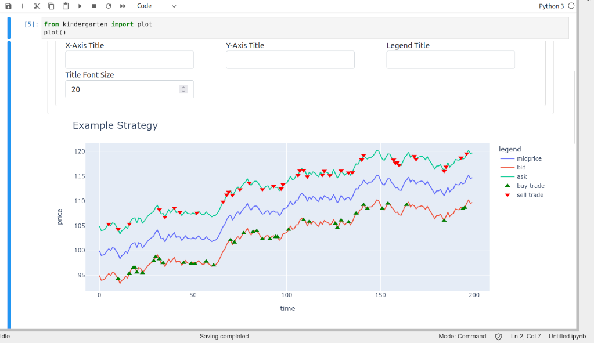

# Kindergarten - Interactive Plotting GUI for Python Notebooks

Kindergarten is a UI on top of Plotly to visualize Pandas DataFrames (and Series).

Simply `pip install kindergarten`, and then do

```python
from kindergarten import plot
import pandas as pd

df = pd.DataFrame({"x": [1, 2, 3], "y": [4, 5, 6]})
plot()
```

in a Jupyter notebook to interactively visualize DataFrames. The library automatically finds all DataFrames
and populates all options with column names etc.

If you need a different number of traces, you can specify the number with `plot(num_traces=10)`.

# Main Features

- supports a large part of the [Plotly](https://www.plotly.com) API
- support for multiple traces that can use data from different dataframes
- `Print Code` button below the plot that allows exporting the code that generates the figures

# Examples

Plotting a single DataFrame:



Plotting several traces:


## Screenshots




# See also

- [short blog post](https://www.henri-froese.com/Kindergarten/) introducing the library and explaining some
  implementation details
- [plotly](https://www.plotly.com)
